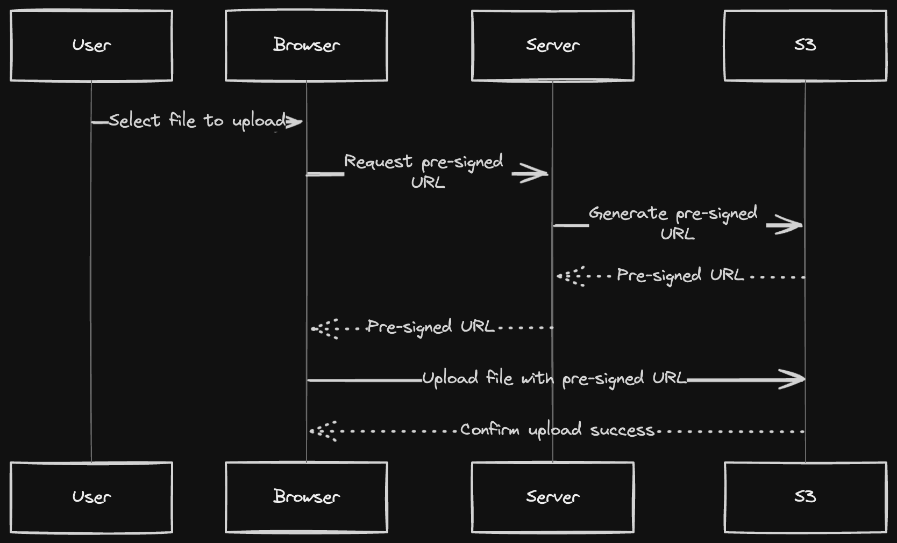

# smoll.host
host your smol website with ease

> [!NOTE]  
> The hosted content is currently displayed through a subdomain of [pritish.in](https://pritish.in). This is achieved using a reverse proxy written in Go, available at [this GitHub repo](https://github.com/PritishMishraa/go-reverse-proxy).

## Technologies Used

- [Next.js 14](https://nextjs.org/docs/getting-started)
- [AWS S3](https://aws.amazon.com/s3/)
- [Upstash Redis](https://upstash.com/)
- [React Dropzone](https://react-dropzone.js.org/)
- [Sonner](https://sonner.emilkowal.ski/)
- [NextUI v2](https://nextui.org/)
- [Tailwind CSS](https://tailwindcss.com/)
- [Tailwind Variants](https://tailwind-variants.org)
- [TypeScript](https://www.typescriptlang.org/)
- [Framer Motion](https://www.framer.com/motion/)
- [next-themes](https://github.com/pacocoursey/next-themes)


## How Files are uploaded


## How to Use

### CLone the repository

```bash
git clone https://github.com/PritishMishraa/smoll-host.git
```

### Install dependencies


```bash
pnpm install
```

### Run the development server

```bash
pnpm dev
```

### Setup pnpm (optional)

If you are using `pnpm`, you need to add the following code to your `.npmrc` file:

```bash
public-hoist-pattern[]=*@nextui-org/*
```

After modifying the `.npmrc` file, you need to run `pnpm install` again to ensure that the dependencies are installed correctly.

## License

Licensed under the [MIT license](https://github.com/nextui-org/next-app-template/blob/main/LICENSE).