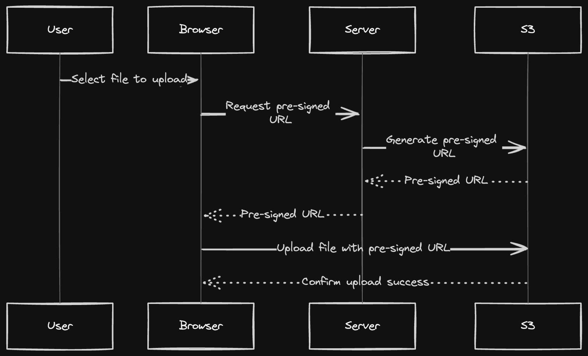

# smoll.host
host your smol website with ease

> [!NOTE]  
> The hosted content is currently displayed through a subdomain of [pritish.in](https://pritish.in). This is achieved using a reverse proxy written in Go, available at [this GitHub repo](https://github.com/PritishMishraa/go-reverse-proxy).

## Technologies Used

- [Next.js 14](https://nextjs.org/docs/getting-started)
- [AWS S3](https://aws.amazon.com/s3/)
- [Neon Postgres](https://neon.tech/)
- [Drizzle ORM](https://orm.drizzle.team/)
- [Better Auth](https://better-auth.com/)
- [Redis Cloud](https://redis.io/cloud/)
- [React Dropzone](https://react-dropzone.js.org/)
- [Sonner](https://sonner.emilkowal.ski/)
- [NextUI v2](https://nextui.org/)
- [Tailwind CSS](https://tailwindcss.com/)
- [Tailwind Variants](https://tailwind-variants.org)
- [TypeScript](https://www.typescriptlang.org/)
- [Zod](https://zod.dev/)
- [Vitest](https://vitest.dev/)
- [Framer Motion](https://www.framer.com/motion/)
- [next-themes](https://github.com/pacocoursey/next-themes)


## How Files are uploaded


## How to Use

### CLone the repository

```bash
git clone https://github.com/PritishMishraa/smoll-host.git
```

### Install dependencies


```bash
pnpm install
```

### Run the development server

```bash
pnpm dev
```

### Environment variables

Create or update `.env` with:

```bash
AWS_BUCKET_NAME=
AWS_REGION=
AWS_ACCESS_KEY_ID=
AWS_SECRET_ACCESS_KEY=

DATABASE_URL=
REDIS_URL=
REDIS_TLS=

BETTER_AUTH_SECRET=
BETTER_AUTH_URL=http://localhost:3000

GITHUB_CLIENT_ID=
GITHUB_CLIENT_SECRET=
```

`DATABASE_URL` comes from Neon. `REDIS_URL` comes from Redis Cloud and is used as a fast cache for domain name lookups; Neon remains the source of truth for ownership. Prefer a `rediss://` Redis Cloud URL. If your Redis Cloud URL is `redis://` but the endpoint requires TLS, set `REDIS_TLS=true`.

This repo was set up with `bunx neonctl`; useful commands are:

```bash
bunx neonctl projects list
bunx neonctl connection-string
pnpm db:generate
pnpm db:migrate
```

`GITHUB_CLIENT_ID` and `GITHUB_CLIENT_SECRET` come from a GitHub OAuth app. For local development, set the callback URL to:

```text
http://localhost:3000/api/auth/callback/github
```

### Setup pnpm (optional)

If you are using `pnpm`, you need to add the following code to your `.npmrc` file:

```bash
public-hoist-pattern[]=*@nextui-org/*
```

After modifying the `.npmrc` file, you need to run `pnpm install` again to ensure that the dependencies are installed correctly.

## License

Licensed under the [MIT license](https://github.com/nextui-org/next-app-template/blob/main/LICENSE).
